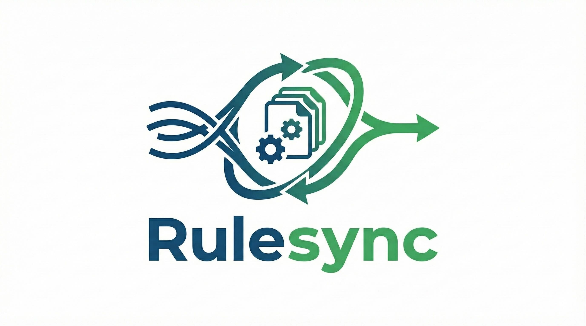

<p align="center">
  
</p>

# Rulesync

[](https://github.com/dyoshikawa/rulesync/actions/workflows/ci.yml)
[](https://www.npmjs.com/package/rulesync)
[](https://www.npmjs.com/package/rulesync)
[](https://deepwiki.com/dyoshikawa/rulesync)
[](https://github.com/hesreallyhim/awesome-claude-code)
[](https://github.com/Piebald-AI/awesome-gemini-cli)
<a href="https://flatt.tech/oss/gmo/trampoline" target="_blank"></a>

**[Documentation](https://dyoshikawa.github.io/rulesync/)** | **[npm](https://www.npmjs.com/package/rulesync)**

A Node.js CLI tool that automatically generates configuration files for various AI development tools from unified AI rule files. Features selective generation, comprehensive import/export capabilities, and supports major AI development tools with rules, commands, MCP, ignore files, subagents and skills.

> [!NOTE]
> If you are interested in Rulesync latest news, please follow the maintainer's X(Twitter) account:
> [@dyoshikawa1993](https://x.com/dyoshikawa1993)

## Installation

```bash
npm install -g rulesync
# or
brew install rulesync
```

### Single Binary (Experimental)

```bash
curl -fsSL https://github.com/dyoshikawa/rulesync/releases/latest/download/install.sh | bash
```

See [Installation docs](https://dyoshikawa.github.io/rulesync/getting-started/installation) for manual install and platform-specific instructions.

## Getting Started

```bash
# Create necessary directories, sample rule files, and configuration file
rulesync init

# Install official skills (recommended)
rulesync fetch dyoshikawa/rulesync --features skills

# Generate unified configurations with all features
rulesync generate --targets "*" --features "*"
```

If you already have AI tool configurations:

```bash
# Import existing files (to .rulesync/**/*)
rulesync import --targets claudecode    # From CLAUDE.md
rulesync import --targets cursor        # From .cursorrules
rulesync import --targets copilot       # From .github/copilot-instructions.md
```

See [Quick Start guide](https://dyoshikawa.github.io/rulesync/getting-started/quick-start) for more details.

## Supported Tools and Features

| Tool               | --targets    | rules | ignore |   mcp    | commands | subagents | skills | hooks |
| ------------------ | ------------ | :---: | :----: | :------: | :------: | :-------: | :----: | :---: |
| AGENTS.md          | agentsmd     |  ✅   |        |          |    🎮    |    🎮     |   🎮   |       |
| AgentsSkills       | agentsskills |       |        |          |          |           |   ✅   |       |
| Claude Code        | claudecode   | ✅ 🌏 |   ✅   |  ✅ 🌏   |  ✅ 🌏   |   ✅ 🌏   | ✅ 🌏  | ✅ 🌏 |
| Codex CLI          | codexcli     | ✅ 🌏 |        | ✅ 🌏 🔧 |    🌏    |    ✅     | ✅ 🌏  |       |
| Gemini CLI         | geminicli    | ✅ 🌏 |   ✅   |  ✅ 🌏   |  ✅ 🌏   |    🎮     | ✅ 🌏  | ✅ 🌏 |
| Goose              | goose        | ✅ 🌏 |   ✅   |          |          |           |        |       |
| GitHub Copilot     | copilot      | ✅ 🌏 |        |    ✅    |    ✅    |    ✅     |   ✅   |  ✅   |
| GitHub Copilot CLI | copilot-cli  |       |        |  ✅ 🌏   |          |           |        |       |
| Cursor             | cursor       |  ✅   |   ✅   |  ✅ 🌏   |  ✅ 🌏   |   ✅ 🌏   | ✅ 🌏  |  ✅   |
| Factory Droid      | factorydroid | ✅ 🌏 |        |  ✅ 🌏   |  ✅ 🌏   |   ✅ 🌏   | ✅ 🌏  | ✅ 🌏 |
| OpenCode           | opencode     | ✅ 🌏 |        | ✅ 🌏 🔧 |  ✅ 🌏   |   ✅ 🌏   | ✅ 🌏  | ✅ 🌏 |
| Cline              | cline        |  ✅   |   ✅   |    ✅    |  ✅ 🌏   |           | ✅ 🌏  |       |
| Kilo Code          | kilo         | ✅ 🌏 |   ✅   |    ✅    |  ✅ 🌏   |           | ✅ 🌏  |       |
| Roo Code           | roo          |  ✅   |   ✅   |    ✅    |    ✅    |    🎮     | ✅ 🌏  |       |
| Qwen Code          | qwencode     |  ✅   |   ✅   |          |          |           |        |       |
| Kiro               | kiro         |  ✅   |   ✅   |    ✅    |    ✅    |    ✅     |   ✅   |       |
| Google Antigravity | antigravity  |  ✅   |        |          |    ✅    |           | ✅ 🌏  |       |
| JetBrains Junie    | junie        |  ✅   |   ✅   |    ✅    |  ✅ 🌏   |    ✅     |   ✅   |       |
| AugmentCode        | augmentcode  |  ✅   |   ✅   |          |          |           |        |       |
| Windsurf           | windsurf     |  ✅   |   ✅   |          |          |           |        |       |
| Warp               | warp         |  ✅   |        |          |          |           |        |       |
| Replit             | replit       |  ✅   |        |          |          |           |   ✅   |       |
| Zed                | zed          |       |   ✅   |          |          |           |        |       |

- ✅: Supports project mode
- 🌏: Supports global mode
- 🎮: Supports simulated commands/subagents/skills (Project mode only)
- 🔧: Supports MCP tool config (`enabledTools`/`disabledTools`)

## Documentation

For full documentation including configuration, CLI reference, file formats, programmatic API, and more, visit the **[documentation site](https://dyoshikawa.github.io/rulesync/)**.

## License

MIT License
