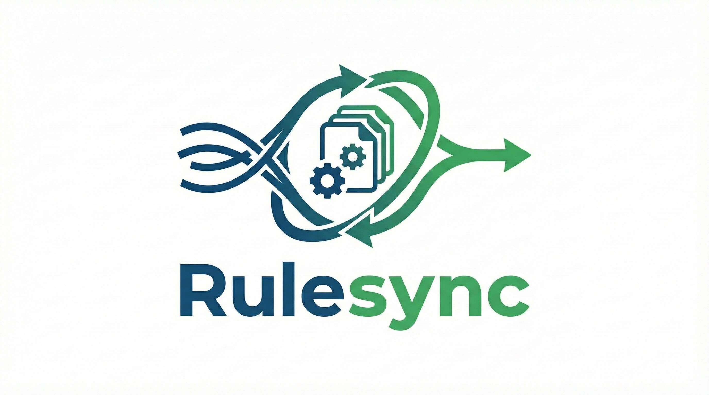

<p align="center">
  
</p>

# Rulesync

[](https://github.com/dyoshikawa/rulesync/actions/workflows/ci.yml)
[](https://www.npmjs.com/package/rulesync)
[](https://www.npmjs.com/package/rulesync)
[](https://deepwiki.com/dyoshikawa/rulesync)
[](https://github.com/hesreallyhim/awesome-claude-code)
[](https://github.com/Piebald-AI/awesome-gemini-cli)
<a href="https://flatt.tech/oss/gmo/trampoline" target="_blank"></a>

**[Documentation](https://dyoshikawa.github.io/rulesync/)** | **[npm](https://www.npmjs.com/package/rulesync)**

A Node.js CLI tool that automatically generates configuration files for various AI development tools from unified AI rule files. Features selective generation, comprehensive import/export capabilities, and supports major AI development tools with rules, commands, MCP, ignore files, subagents and skills.

> [!NOTE]
> If you are interested in Rulesync latest news, please follow the maintainer's X(Twitter) account:
> [@dyoshikawa1993](https://x.com/dyoshikawa1993)

## Installation

```bash
npm install -g rulesync
```

Or install from our Homebrew tap (macOS and Linux):

```bash
brew tap dyoshikawa/rulesync https://github.com/dyoshikawa/rulesync
brew install rulesync
```

The tap lives inside this repository, so it does not have a `homebrew-` prefix.
The two-argument `brew tap <name> <url>` form is therefore required — the
shorthand `brew install dyoshikawa/rulesync/rulesync` without tapping first does
not work.

### Single Binary

```bash
curl -fsSL https://github.com/dyoshikawa/rulesync/releases/latest/download/install.sh | bash
```

See [Installation docs](https://dyoshikawa.github.io/rulesync/getting-started/installation) for manual install and platform-specific instructions.

## Getting Started

```bash
# Create necessary directories, sample rule files, and configuration file
rulesync init

# Install official skills (recommended)
rulesync fetch dyoshikawa/rulesync

# Generate unified configurations with all features
rulesync generate --targets "*" --features "*"
```

If you already have AI tool configurations:

```bash
# Import existing files (to .rulesync/**/*)
rulesync import --targets claudecode    # From CLAUDE.md
rulesync import --targets cursor        # From .cursorrules
rulesync import --targets copilot       # From .github/copilot-instructions.md
```

Want to convert configuration from one AI tool to another directly, without
adopting the `.rulesync/` source-of-truth workflow?

```bash
# Convert Cursor rules to Copilot and Claude Code in one shot (no .rulesync/ files written)
rulesync convert --from cursor --to copilot,claudecode
```

See [Quick Start guide](https://dyoshikawa.github.io/rulesync/getting-started/quick-start) for more details.

## Supported Tools and Features

The tables below show whether each tool supports a given feature (✅ = supported, blank = not supported). A ✅ means the feature is supported in at least one mode (project, global, or simulated) — for example, Codex CLI `commands` is global-only. For each tool's `--targets` value and full mode breakdown (project / global / simulated / MCP tool config), see the [Supported Tools reference](https://dyoshikawa.github.io/rulesync/reference/supported-tools).

### AI Coding Tools

<!-- SUPPORTED_TOOLS_AI:BEGIN -->

| Tool                      | rules | ignore | mcp | commands | subagents | skills | hooks | permissions | checks |
| ------------------------- | :---: | :----: | :-: | :------: | :-------: | :----: | :---: | :---------: | :----: |
| Amp                       |  ✅   |        | ✅  |          |           |   ✅   |  ✅   |     ✅      |   ✅   |
| Claude Code               |  ✅   |   ✅   | ✅  |    ✅    |    ✅     |   ✅   |  ✅   |     ✅      |        |
| Claude Code plugin        |       |        | ✅  |    ✅    |    ✅     |   ✅   |  ✅   |             |        |
| Codex CLI                 |  ✅   |        | ✅  |    ✅    |    ✅     |   ✅   |  ✅   |     ✅      |        |
| GitHub Copilot            |  ✅   |        | ✅  |    ✅    |    ✅     |   ✅   |  ✅   |     ✅      |        |
| GitHub Copilot CLI        |  ✅   |        | ✅  |          |    ✅     |   ✅   |  ✅   |     ✅      |        |
| Goose                     |  ✅   |        | ✅  |    ✅    |    ✅     |   ✅   |  ✅   |     ✅      |        |
| Hermes Agent              |  ✅   |   ✅   | ✅  |    ✅    |    ✅     |   ✅   |  ✅   |     ✅      |   ✅   |
| Grok CLI                  |  ✅   |        | ✅  |    ✅    |    ✅     |   ✅   |  ✅   |     ✅      |        |
| Cursor                    |  ✅   |   ✅   | ✅  |    ✅    |    ✅     |   ✅   |  ✅   |     ✅      |   ✅   |
| deepagents-cli            |  ✅   |        | ✅  |          |    ✅     |   ✅   |  ✅   |     ✅      |        |
| Factory Droid             |  ✅   |        | ✅  |    ✅    |    ✅     |   ✅   |  ✅   |     ✅      |   ✅   |
| OpenCode                  |  ✅   |        | ✅  |    ✅    |    ✅     |   ✅   |  ✅   |     ✅      |        |
| Cline                     |  ✅   |   ✅   | ✅  |    ✅    |    ✅     |   ✅   |  ✅   |     ✅      |        |
| Kilo Code                 |  ✅   |   ✅   | ✅  |    ✅    |    ✅     |   ✅   |  ✅   |     ✅      |        |
| Kimi Code                 |  ✅   |        | ✅  |          |    ✅     |   ✅   |  ✅   |     ✅      |        |
| Roo Code ⚠️               |  ✅   |   ✅   | ✅  |    ✅    |    ✅     |   ✅   |       |     ✅      |        |
| Zoo Code                  |  ✅   |   ✅   | ✅  |    ✅    |    ✅     |   ✅   |       |     ✅      |        |
| Rovodev (Atlassian)       |  ✅   |        | ✅  |    ✅    |    ✅     |   ✅   |       |     ✅      |   ✅   |
| Takt                      |  ✅   |        | ✅  |    ✅    |    ✅     |   ✅   |       |     ✅      |   ✅   |
| Vibe Code                 |  ✅   |   ✅   | ✅  |          |    ✅     |   ✅   |  ✅   |     ✅      |        |
| Qwen Code                 |  ✅   |   ✅   | ✅  |    ✅    |    ✅     |   ✅   |  ✅   |     ✅      |        |
| Meta Muse Code            |  ✅   |        | ✅  |          |           |   ✅   |       |             |        |
| Reasonix                  |  ✅   |   ✅   | ✅  |    ✅    |    ✅     |   ✅   |  ✅   |     ✅      |        |
| Kiro ⚠️                   |  ✅   |   ✅   | ✅  |    ✅    |    ✅     |   ✅   |  ✅   |     ✅      |        |
| Kiro CLI                  |  ✅   |   ✅   | ✅  |    ✅    |    ✅     |   ✅   |  ✅   |     ✅      |        |
| Kiro IDE                  |  ✅   |   ✅   | ✅  |    ✅    |    ✅     |   ✅   |  ✅   |     ✅      |        |
| Google Antigravity IDE    |  ✅   |        | ✅  |    ✅    |    ✅     |   ✅   |  ✅   |     ✅      |        |
| Google Antigravity CLI    |  ✅   |   ✅   | ✅  |    ✅    |    ✅     |   ✅   |  ✅   |     ✅      |        |
| Google Antigravity plugin |  ✅   |        | ✅  |          |    ✅     |   ✅   |  ✅   |             |        |
| JetBrains AI Assistant    |  ✅   |   ✅   | ✅  |          |           |   ✅   |       |             |        |
| JetBrains Junie           |  ✅   |   ✅   | ✅  |    ✅    |    ✅     |   ✅   |  ✅   |     ✅      |        |
| AugmentCode               |  ✅   |   ✅   | ✅  |    ✅    |    ✅     |   ✅   |  ✅   |     ✅      |   ✅   |
| Devin Desktop             |  ✅   |   ✅   | ✅  |    ✅    |    ✅     |   ✅   |  ✅   |     ✅      |        |
| Warp                      |  ✅   |   ✅   | ✅  |    ✅    |           |   ✅   |       |     ✅      |        |
| Replit                    |  ✅   |        |     |          |           |   ✅   |       |             |        |
| Pi Coding Agent           |  ✅   |        |     |    ✅    |           |   ✅   |  ✅   |     ✅      |        |
| Zed                       |  ✅   |   ✅   | ✅  |          |           |   ✅   |       |     ✅      |        |
| ZCode (Z.ai)              |  ✅   |        | ✅  |    ✅    |    ✅     |   ✅   |       |             |        |

<!-- SUPPORTED_TOOLS_AI:END -->

### Open Standards

<!-- SUPPORTED_TOOLS_STANDARD:BEGIN -->

| Tool         | rules | ignore | mcp | commands | subagents | skills | hooks | permissions | checks |
| ------------ | :---: | :----: | :-: | :------: | :-------: | :----: | :---: | :---------: | :----: |
| AGENTS.md    |  ✅   |        |     |    ✅    |    ✅     |   ✅   |       |             |        |
| AgentsSkills |       |        |     |          |           |   ✅   |       |             |        |

<!-- SUPPORTED_TOOLS_STANDARD:END -->

- ⚠️: Deprecated — still supported, but see the note below

### Target and deprecation notes

- **Ignore feature** — The `ignore` feature is deprecated in favor of the more expressive `permissions` feature. Existing ignore configurations remain supported throughout Rulesync 14.x; removal, if any, will be decided separately and will not occur before a future major release. New `rulesync init` projects scaffold permissions without enabling or creating ignore files. See the [migration guide](https://dyoshikawa.github.io/rulesync/reference/file-formats#rulesync-aiignore-or-rulesyncignore-deprecated).
- **Google Antigravity (`antigravity-ide` / `antigravity-cli`)** — Antigravity 2.0 splits into two products with separate global config trees: the desktop **`antigravity-ide`** and the **`antigravity-cli`** (`agy`). For project-scope rules, **both `antigravity-ide` and `antigravity-cli`** emit the root rule as a plain cross-tool **`AGENTS.md`** at the project root (the Gemini-lineage discovery order is `AGENTS.md`, `CONTEXT.md`, `GEMINI.md`; the IDE has read `AGENTS.md` since v1.20.3) and non-root rules under `.agents/rules/`.
- **Plugin packaging (`claudecode-plugin` / `antigravity-plugin`)** — These project-only targets generate and import Rulesync-managed components inside an existing plugin directory selected with `--output-roots` (generate) or `--output-root` (import). They are excluded from `--targets "*"` to avoid writing package-level `skills/`, `rules/`, or `commands/` directories into ordinary projects. Rulesync preserves plugin manifests, marketplace metadata, scripts, and other non-component assets. See the [Plugin Packaging guide](https://dyoshikawa.github.io/rulesync/guide/plugin-packaging).
- **Kiro (`kiro`)** — Kiro's IDE and CLI use diverging config formats (IDE: Markdown subagents `.kiro/agents/*.md`; CLI: JSON agent-config subagents `.kiro/agents/*.json`), so `kiro` is split into **`kiro-cli`** and **`kiro-ide`**. The legacy `kiro` target remains as a **deprecated alias** with its current behavior unchanged. The two targets share every surface except **subagents** (Markdown vs JSON); both emit hooks as a single `.kiro/hooks/rulesync.json` (`{ "version": "v1", "hooks": [ ... ] }`) in project (`.kiro/hooks/`) and global (`~/.kiro/hooks/`) scope, the format Kiro CLI 3.0 [migrated to](https://kiro.dev/docs/cli/v3/hooks-migration/). Only the deprecated `kiro` alias still writes hooks into `.kiro/agents/default.json`, which the CLI no longer reads. Global skills (`~/.kiro/skills/`), global ignore (`~/.kiro/settings/kiroignore`), and global Kiro IDE subagents (`~/.kiro/agents/`) are supported too, as are global Kiro CLI commands (`~/.kiro/prompts/`) and subagents (`~/.kiro/agents/`). Kiro MCP generation preserves per-server `disabledTools`, and the deprecated `kiro` alias's hook caching maps `cacheTtl` to `cache_ttl_seconds`.
- **Roo Code (`roo`)** — Roo Code is end of life: its final release was **v3.54.0 (2026-05-15)** and its repository is archived. New projects should target **`zoocode`** ([Zoo Code](https://github.com/Zoo-Code-Org/Zoo-Code)), the community continuation named by the Roo shutdown notice. The `roo` target stays supported because Zoo Code still reads the same `.roo/` project tree and `~/.roo` global tree, so existing output keeps working — it just no longer tracks anything Zoo Code added after the fork. Enable one of the two targets per project, not both. See [Supported tools > Deprecation notes](https://dyoshikawa.github.io/rulesync/reference/supported-tools#deprecation-notes).

Some features accept per-feature options. See [Configuration > Per-feature options](https://dyoshikawa.github.io/rulesync/guide/configuration#per-feature-options) for details.

## Documentation

For full documentation including configuration, CLI reference, file formats, programmatic API, and more, visit the **[documentation site](https://dyoshikawa.github.io/rulesync/)**.

## License

MIT License
